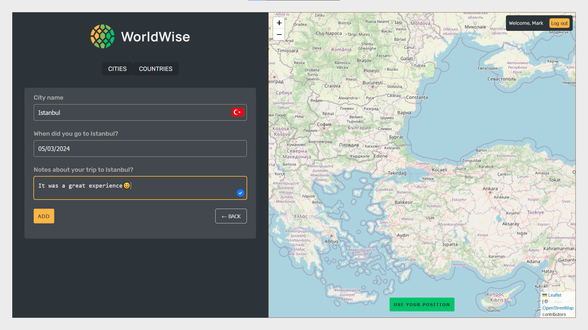

# WorldWise

WorldWise is a travel planning application that allows users to track their visited cities and plan future trips. This project was inspired by Jonas Schmedtmann's "The Ultimate React Course" but built from scratch using different technologies like React Query and Firebase.

## Table of Contents

- [Overview](#overview)
  - [Key Features](#key-features)
  - [Screenshots](#screenshots)
  - [Live Demo](#live-demo)
- [Technology Stack](#technology-stack)
- [Getting Started](#getting-started)
- [What I Learned](#what-i-learned)
- [Author](#author)

## Overview

### Key Features

- User authentication (login/signup)
- Interactive map for adding travel plans
- City and country management (add, view, delete)
- Geolocation support
- Persistent user data across sessions

### Screenshot

### Live Demo

Experience WorldWise: [Live Site](https://worldwise-rose.vercel.app)

## Technology Stack

- React
- React Router for navigation
- Tanstack Query for state management
- Firebase for backend services
- CSS Modules for styling
- Semantic HTML5
- Responsive design (mobile-first approach)

## Getting Started

1. Clone the repository
2. Install dependencies: `npm install`
3. Set up Firebase configuration (it's sat up but you could use your own)
4. Run the development server: `npm run dev`

## What I Learned

- Advanced routing techniques for large-scale React applications
- Efficient remote state management using React Query
- Best practices for React component architecture and reusability
- Integration of Firebase for authentication and data storage

## Author

- Twitter: [@medaichx](https://www.twitter.com/medaichx)
- GitHub: [@medaich](https://www.github.com/medaich)

---

This project showcases modern React development practices and demonstrates proficiency in building complex, interactive web applications.
